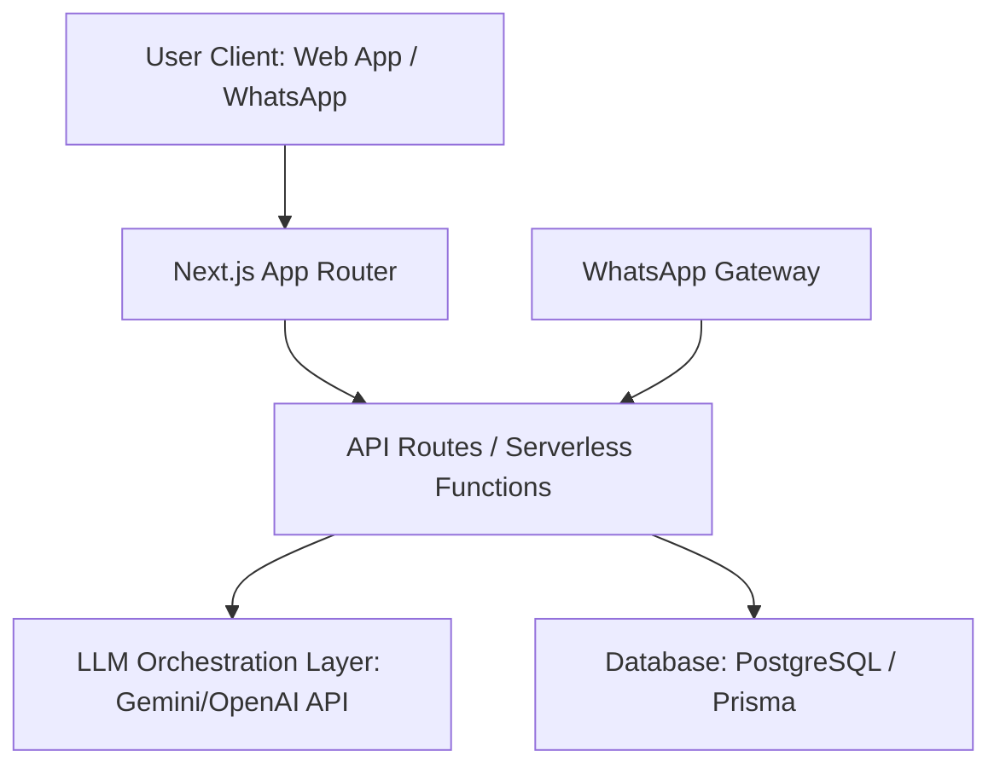

# BorderLine: AI Agent Source of Truth (SOT)

This document is the **Single Source of Truth (SOT)** for the development of BorderLine. Any AI agent (or developer) working on this repository MUST read and adhere to the guidelines, architectures, and styling systems outlined here.

Whenever major architectural changes, new schema definitions, or design decisions are made, this file **MUST** be updated to prevent drift.

---

## 1. Project Core Vision
BorderLine is an AI-powered talent validation and acceleration platform designed for African students, self-taught creators, and entry-level freelancers (ages 18–26).
* **The Problem**: Traditional job networks (LinkedIn, Upwork) rely on text-based resumes and historical platform ratings. This creates a "Resume Trap" where entry-level talent cannot find opportunities because they lack corporate work history.
* **The Solution**: An AI-driven "Trust Layer" that converts raw class projects, offline hackathon repos, and design concepts into professional, result-oriented case studies.
* **Key Access Strategy**: A lightweight WhatsApp chatbot extension that allows cash-constrained users to update profiles, receive matches, and check jobs without loading heavy, data-intensive web pages.

---

## 2. Technical Stack & Architecture



* **Frontend**: Next.js App Router (React, TypeScript).
* **Styling**: Vanilla CSS designed with CSS variables for modular token usage.
* **AI Orchestration**: Cloud-hosted LLM endpoints (prioritizing Gemini API for regional efficiency and speed) to parse messy project files and format them into standardized templates.
* **Database**: PostgreSQL (interfaced via Prisma ORM) to manage user profiles, projects, matchings, and WhatsApp subscriber states.
* **Low-Data Extension**: A WhatsApp webhook API handler linked to a message routing service (like Twilio or Meta WhatsApp Cloud API).

---

## 3. Brand Identity & Styling System
To maintain the visual aesthetics defined by the brand consultants, all UI components must follow these tokens.

### A. Color Palette
```css
:root {
  /* Foundations */
  --color-bg-dark: #070913;      /* Deep Midnight Blue */
  --color-card-bg: rgba(15, 20, 39, 0.6); /* Translucent Navy for Glassmorphism */
  --color-border: rgba(255, 255, 255, 0.08);

  /* Typography */
  --color-text-primary: #F8FAFC;  /* Off-White */
  --color-text-secondary: #94A3B8;/* Cool Slate */

  /* Vibrant Accents */
  --color-teal: #0D9488;          /* Primary Action / Trust */
  --color-amber: #D97706;         /* Alerts / Highlights */
  --color-orange: #EA580C;        /* Energy / Accent */
  
  /* Gradients */
  --gradient-glow: radial-gradient(circle at top left, rgba(13, 148, 136, 0.15), transparent 60%);
}
```

### B. Typography
* **Primary Font**: `Inter`, `Plus Jakarta Sans`, or `Satoshi` (sans-serif).
* Avoid browser default fonts. Maintain clean vertical rhythm and hierarchy.

### C. UI Aesthetics (Glassmorphism)
All cards and interactive modules should feel like frosted glass:
* **Background**: `rgba(15, 20, 39, 0.6)` with `backdrop-filter: blur(12px)`.
* **Border**: Subtle, thin borders: `1px solid rgba(255, 255, 255, 0.08)`.
* **Shadows**: Smooth, soft drop-shadows to give depth: `box-shadow: 0 8px 32px 0 rgba(0, 0, 0, 0.37)`.
* **Hover Micro-animations**: Slight translate and glow effects when cards or buttons are hovered:
  ```css
  .interactive-card:hover {
    transform: translateY(-2px);
    border-color: rgba(13, 148, 136, 0.3);
    box-shadow: 0 12px 40px 0 rgba(13, 148, 136, 0.1);
  }
  ```

---

## 4. AI Agent Workflow Rules

1. **Check this SOT first**: Whenever starting a task, open this file to review active paradigms.
2. **Never leave placeholders**: All components must be fully styled, functioning, and populated with realistic mock data or actual outputs. Use image generation tools for required illustrations.
3. **Responsive Design**: Ensure mobile-first layouts since many users in Sub-Saharan Africa access the platform via mobile browsers under data-constrained conditions.
4. **Update Logs**: When creating new directories or altering the DB schema, immediately document the change in this SOT.
