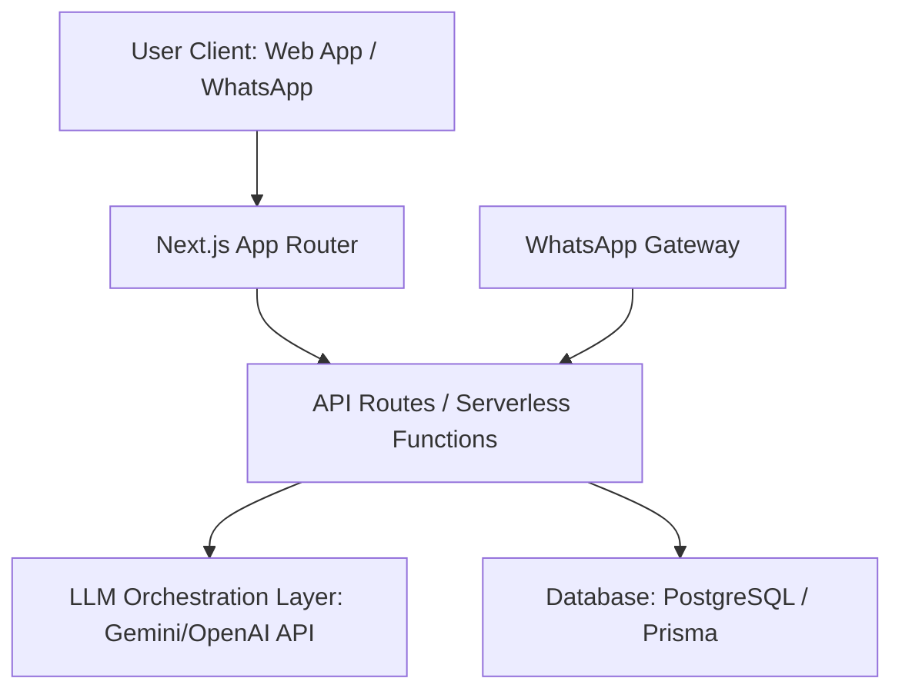

# BorderLine: AI Agent Source of Truth (SOT)

This document is the **Single Source of Truth (SOT)** for the development of BorderLine. Any AI agent (or developer) working on this repository MUST read and adhere to the guidelines, architectures, and styling systems outlined here.

Whenever major architectural changes, new schema definitions, or design decisions are made, this file **MUST** be updated to prevent drift.

---

## 1. Project Core Vision
BorderLine is an AI-powered economic infrastructure that verifies, connects, and monetises the continent's emerging builders (ages 18–26).
* **The Problem**: Traditional job networks (LinkedIn, Upwork) rely on text-based resumes and historical platform ratings. This excludes early-career builders who lack corporate work history but have practical skills.
* **The Solution**: An AI-driven "Trust Layer" that converts raw class projects, offline hackathon repos, and design concepts into professional, result-oriented case studies.
* **Key Access Strategy**: A lightweight WhatsApp chatbot extension that allows cash-constrained users to update profiles, receive matches, and check jobs without loading heavy, data-intensive web pages.

---

## 2. Technical Stack & Architecture



* **Frontend**: Next.js App Router (React, TypeScript).
* **Styling**: Vanilla CSS designed with CSS variables for modular token usage.
* **AI Orchestration**: Cloud-hosted LLM endpoints (prioritizing Gemini API for regional efficiency and speed) to parse messy project files and format them into standardized templates.
* **Database**: PostgreSQL (interfaced via Prisma ORM) to manage user profiles, projects, matchings, and WhatsApp subscriber states.
* **Low-Data Extension**: A WhatsApp webhook API handler linked to a message routing service (like Twilio or Meta WhatsApp Cloud API).

---

## 3. Brand Identity & Styling System
To maintain the visual aesthetics defined by the brand consultants, all UI components must follow these tokens.

### A. Color Palette
```css
:root {
  /* Foundations */
  --color-bg-light: #FFFFFF;      /* Clean White */
  --color-surface: #FAFAFA;       /* Warm Gray-50 */
  --color-surface-elevated: #FFFFFF; /* White Cards */
  --color-border: #E5E7EB;        /* Gray-200 */

  /* Typography */
  --color-text-primary: #111827;  /* Gray-900 */
  --color-text-secondary: #6B7280;/* Gray-500 */
  --color-text-tertiary: #9CA3AF; /* Gray-400 */

  /* Accents */
  --color-accent: #16A34A;        /* Forest Green - Trust / Growth */
  --color-accent-hover: #15803D;  /* Darker Green */
  --color-accent-subtle: #F0FDF4; /* Green-50 - Badge Backgrounds */
  --color-accent-secondary: #4F46E5; /* Indigo-600 */
  
  /* Utilities */
  --color-danger: #DC2626;        /* Red-600 */
  --color-hero-bg: #111827;       /* Dark Section Background */
}
```

### B. Typography
* **Display Font**: `DM Sans` (sans-serif), bold, tight letter spacing. Used for large headers and hero sections.
* **Primary Font**: `Inter` (sans-serif). Used for body text and standard UI elements.
* **Monospace**: `JetBrains Mono` for code snippets.
* Avoid browser default fonts. Maintain clean vertical rhythm and hierarchy.

### C. UI Aesthetics (Clean Light Mode)
All cards and interactive modules should feel crisp, clean, and professional:
* **Background**: `var(--color-surface-elevated)` (`#FFFFFF`).
* **Border**: Subtle, thin borders: `1px solid var(--color-border)`.
* **Shadows**: Smooth, soft drop-shadows to give depth: `box-shadow: 0 1px 3px 0 rgba(0, 0, 0, 0.08)`.
* **Hover Micro-animations**: Slight border color and shadow changes:
  ```css
  .interactive-card {
    transition: box-shadow 0.2s ease, border-color 0.2s ease;
  }
  .interactive-card:hover {
    border-color: #D1D5DB;
    box-shadow: 0 4px 12px 0 rgba(0, 0, 0, 0.1);
  }
  ```

---

## 4. Design Principles
1. **Clean over clever** — No blur effects, no glow states. Whitespace is the primary design tool.
2. **Data-forward** — Lead with numbers (e.g., users placed, jobs matched, avg earnings).
3. **Restrained accent usage** — Green accent only for CTAs and success states. Body text is gray-900 on white.
4. **Enterprise-credible** — Every screen should look like it belongs on a pitch deck.
5. **Mobile-optimized** — Components must render cleanly on data-constrained mobile browsers.

---

## 5. AI Agent Workflow Rules

1. **Check this SOT first**: Whenever starting a task, open this file to review active paradigms.
2. **Never leave placeholders**: All components must be fully styled, functioning, and populated with realistic mock data or actual outputs. Use image generation tools for required illustrations.
3. **Responsive Design**: Ensure mobile-first layouts since many users in Sub-Saharan Africa access the platform via mobile browsers under data-constrained conditions.
4. **Update Logs**: When creating new directories or altering the DB schema, immediately document the change in this SOT.
