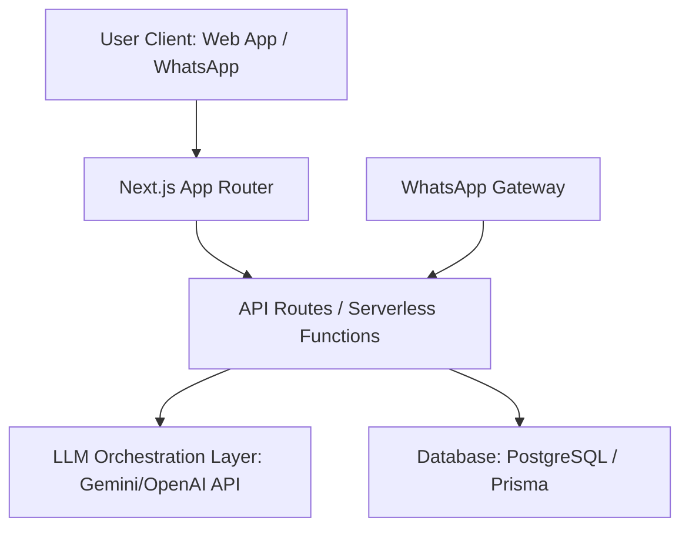

# BorderLine: AI Agent Source of Truth (SOT)

This document is the **Single Source of Truth (SOT)** for the development of BorderLine. Any AI agent (or developer) working on this repository MUST read and adhere to the guidelines, architectures, and styling systems outlined here.

Whenever major architectural changes, new schema definitions, or design decisions are made, this file **MUST** be updated to prevent drift.

---

## 1. Project Core Vision
BorderLine is an AI-powered economic infrastructure that verifies, connects, and monetises the continent's emerging builders (ages 18–26).
* **The Problem**: Traditional job networks (LinkedIn, Upwork) rely on text-based resumes and historical platform ratings. This excludes early-career builders who lack corporate work history but have practical skills.
* **The Solution**: A hybrid AI-driven and peer-verified "Trust Layer" that converts raw class projects, offline hackathon repos, and design concepts into professional, result-oriented case studies, backed by automated codebase audits and collaborative peer validations from the developer community.
* **Key Access Strategy**: A lightweight WhatsApp chatbot extension that allows cash-constrained users to update profiles, receive matches, and check jobs without loading heavy, data-intensive web pages.

---

## 2. Technical Stack & Architecture



* **Frontend**: Next.js App Router (React, TypeScript).
* **Styling**: Vanilla CSS designed with CSS variables for modular token usage.
* **AI Orchestration**: Cloud-hosted LLM endpoints (prioritizing Gemini API for regional efficiency and speed) to parse messy project files and format them into standardized templates.
* **Database**: PostgreSQL (interfaced via Prisma ORM) to manage user profiles, projects, matchings, and WhatsApp subscriber states.
* **Low-Data Extension**: A WhatsApp webhook API handler linked to a message routing service (like Twilio or Meta WhatsApp Cloud API).

---

## 3. Brand Identity & Styling System
To maintain the visual aesthetics defined by the brand consultants, all UI components must follow these tokens.

### A. Color Palette
```css
:root {
  /* Foundations */
  --color-bg: #030712;            /* Deep Black/Charcoal */
  --color-surface: #0B0F19;       /* Slate Dark-900 */
  --color-surface-elevated: #0E1420; /* Slate Dark-800 - Standard Cards */
  --color-surface-darkgreen: #05180D; /* Hunter Green - Features Background */
  --color-border: #1F2937;        /* Muted Gray Border */

  /* Typography */
  --color-text-primary: #FFFFFF;  /* White */
  --color-text-secondary: #9CA3AF;/* Light Muted Gray */
  --color-text-tertiary: #6B7280; /* Dark Muted Gray */

  /* Accents */
  --color-accent: #22C55E;        /* Neon Green - Trust / Growth */
  --color-accent-hover: #16A34A;  /* Darker Green */
  --color-accent-subtle: rgba(34, 197, 94, 0.1); /* Subtle green fill */
  --color-accent-secondary: #10B981; /* Emerald green */
  
  /* Utilities */
  --color-danger: #EF4444;        /* Soft Red */
  --color-hero-bg: #030712;       /* Dark Section Background */
}
```

### B. Typography
* **Display Font**: `DM Sans` (sans-serif), bold, tight letter spacing. Used for large headers and hero sections.
* **Primary Font**: `Inter` (sans-serif). Used for body text and standard UI elements.
* **Monospace**: `JetBrains Mono` for code snippets.
* Avoid browser default fonts. Maintain clean vertical rhythm and hierarchy.

### C. UI Aesthetics (Adaptive Dual-Theme Switcher)
BorderLine supports both **Dark Mode** and **Light Mode** globally. A toggle selector in the navigation bar allows any user (talent, recruiter, or admin) to swap themes dynamically. Components must pull from theme-based CSS custom properties:

```css
/* Dark Theme Variables */
body.dark-theme {
  --color-bg: #030712;
  --color-surface: #0B0F19;
  --color-surface-elevated: #0E1420;
  --color-surface-greenblock: #05180D;
  --color-border: #1F2937;
  --color-text-primary: #FFFFFF;
  --color-text-secondary: #9CA3AF;
  --color-text-tertiary: #6B7280;
  --color-accent: #22C55E;
  --color-accent-hover: #16A34A;
  --color-accent-subtle: rgba(34, 197, 94, 0.1);
  --color-accent-secondary: #10B981;
  --color-danger: #EF4444;
}

/* Light Theme Variables */
body.light-theme {
  --color-bg: #FFFFFF;
  --color-surface: #FAFAFA;
  --color-surface-elevated: #FFFFFF;
  --color-surface-greenblock: #F0FDF4;
  --color-border: #E5E7EB;
  --color-text-primary: #111827;
  --color-text-secondary: #6B7280;
  --color-text-tertiary: #9CA3AF;
  --color-accent: #16A34A;
  --color-accent-hover: #15803D;
  --color-accent-subtle: #F0FDF4;
  --color-accent-secondary: #4F46E5;
  --color-danger: #DC2626;
}
```
* **Interactive Hover Micro-animations (Unified)**:
  ```css
  .card-interactive {
    transition: box-shadow 0.2s ease, border-color 0.2s ease, transform 0.2s ease;
  }
  .card-interactive:hover {
    border-color: var(--color-accent);
    box-shadow: 0 4px 15px 0 var(--color-accent-subtle);
    transform: translateY(-2px);
  }
  ```

---

## 4. Design Principles
1. **Clean over clever** — Soft drop-shadows (light mode) are replaced by high-contrast borders and subtle hover glows (dark mode). Whitespace is the primary design tool.
2. **Data-forward** — Lead with numbers (e.g., verified stats, user earnings, match latency) using scroll-triggered flip-up wheel or odometer animations.
3. **Restrained accent usage** — Dynamic green accent is used for active state capsules, checkmarks, stats, and CTAs (Neon Green `#22C55E` in dark mode, Forest Green `#16A34A` in light mode).
4. **Adaptive Context** — Ensure interfaces are legible, high-contrast, and performant in both light and dark settings.
5. **Mobile-optimized** — Ensure layouts collapse beautifully and efficiently on mobile screens for users with data and connectivity limits.

---

## 5. AI Agent Workflow Rules

1. **Check this SOT first**: Whenever starting a task, open this file to review active paradigms.
2. **Never leave placeholders**: All components must be fully styled, functioning, and populated with realistic mock data or actual outputs. Use image generation tools for required illustrations.
3. **Responsive Design**: Ensure mobile-first layouts since many users in Sub-Saharan Africa access the platform via mobile browsers under data-constrained conditions.
4. **Update Logs**: When creating new directories or altering the DB schema, immediately document the change in this SOT.

---

## 6. Update Log

### 2026-06-15: MVP Platform Foundation Implementation
* **Folder Structure & State**:
  * Created [index.ts](file:///C:/Users/gokro/.gemini/antigravity/worktrees/borderline/build-mvp-platform-foundation/src/types/index.ts) with TypeScript definitions for User, Profile, Project, RecruiterProfile, Gig, Application, and WhatsAppMessage.
  * Created [mockData.ts](file:///C:/Users/gokro/.gemini/antigravity/worktrees/borderline/build-mvp-platform-foundation/src/data/mockData.ts) containing initial African builder profiles, micro-gigs, and applications.
  * Created [db.ts](file:///C:/Users/gokro/.gemini/antigravity/worktrees/borderline/build-mvp-platform-foundation/src/services/db.ts) implementing persistent `localStorage` synchronization.
  * Created [ai.ts](file:///C:/Users/gokro/.gemini/antigravity/worktrees/borderline/build-mvp-platform-foundation/src/services/ai.ts) wrapping case study generation calls.
  * Created [AppContext.tsx](file:///C:/Users/gokro/.gemini/antigravity/worktrees/borderline/build-mvp-platform-foundation/src/context/AppContext.tsx) implementing global React context, layout theme selectors, and reactive WhatsApp chatbot parser.
  * Created [Header.tsx](file:///C:/Users/gokro/.gemini/antigravity/worktrees/borderline/build-mvp-platform-foundation/src/components/shared/Header.tsx) featuring responsive glassmorphic headers.
* **API Endpoints**:
  * Created [route.ts](file:///C:/Users/gokro/.gemini/antigravity/worktrees/borderline/build-mvp-platform-foundation/src/app/api/generate-case-study/route.ts) supporting Gemini API connectivity with clean simulated fallback gates.
* **Platform Views**:
  * Landing page ([page.tsx](file:///C:/Users/gokro/.gemini/antigravity/worktrees/borderline/build-mvp-platform-foundation/src/app/page.tsx)) with animated survey tickers.
  * Talent dashboard ([page.tsx](file:///C:/Users/gokro/.gemini/antigravity/worktrees/borderline/src/app/talent/page.tsx)) with compiler log terminals and mobile matching preview.
  * Recruiter portal ([page.tsx](file:///C:/Users/gokro/.gemini/antigravity/src/app/recruiter/page.tsx)) with candidate detail drawers and post-gig modal managers.
  * WhatsApp sandbox ([page.tsx](file:///C:/Users/gokro/.gemini/antigravity/src/app/whatsapp/page.tsx)) with real-time text parsing simulator.
  * Admin dashboard ([page.tsx](file:///C:/Users/gokro/.gemini/antigravity/src/app/admin/page.tsx)) with stats counters and system transaction ledger feeds.
