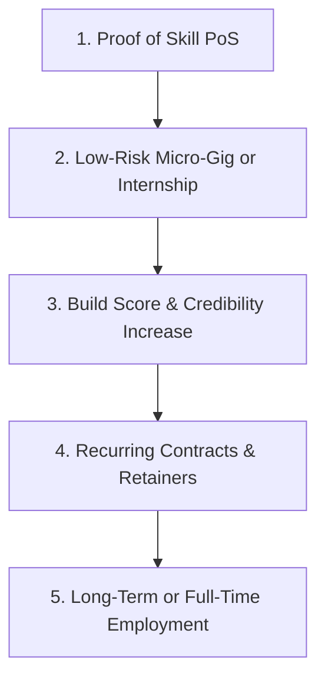

# The BorderLine Manifesto: Africans Hiring Africans

Traditional work platforms have failed the African market. They were designed for Western dynamics, focusing on legacy credentials, platform reviews, and costly bidding processes. This creates an insurmountable trust wall for Africa’s emerging builders.

BorderLine is not just a job board. We are the **trust and payment protocol for intra-continental tech hiring**. 

Our mission is to empower the next generation of African developers, designers, and creators by enabling frictionless, intra-continental commerce.

---

## 1. The Core Tenet: Africans Hiring Africans

The fastest-growing tech hubs in Africa—Lagos, Cape Town, Nairobi, Cairo, Accra, and Kigali—are teeming with brilliant, self-taught junior talent. At the same time, regional startups are expanding rapidly and need affordable, capable builders to scale their MVPs. 

Yet, hiring across borders within Africa has historically been broken. BorderLine solves the three critical pan-African friction points:

1. **The Pan-African Payment Rail**: Sending fiat currency between African nations is notoriously slow and expensive, often requiring double-conversion through USD. BorderLine integrates direct, low-cost cross-border currency routing (e.g., ZAR to NGN) settled instantly via Mobile Money wallets (M-Pesa, Wave, MTN Momo). We remove the payment friction so companies can hire anywhere.
2. **The Unified Trust Standard**: Startups in South Africa have no visibility into university or bootcamp ecosystems in Nigeria or Uganda. By replacing subjective resumes with our automated **Proof of Skill (PoS)** audit, we establish a standardized **Build Score** that guarantees technical capability across borders.
3. **Cross-Border Escrow**: Because cross-border legal action is impossible for small contracts, we protect both parties with integrated milestone-based escrow. Startups only pay for verified, delivered code, and developers are guaranteed secure payouts.

---

## 2. The Career Engine: The Gig-to-Career Lifecycle

We do not force immediate, long-term remote hires. For startups, hiring junior developers across borders carries high training and commitment risk. For juniors, getting that first long-term contract is incredibly difficult without experience.

BorderLine solves this through a structured **Gig-to-Career Lifecycle**:

1. **Low-Risk Gigs & Internships**: We start by matching builders with targeted, short-term micro-gigs (e.g., building a landing page, structuring a database) or 3-month structured internships. This lowers the entry barrier and financial risk for cash-constrained startups.
2. **The Credibility Engine**: Every completed gig, commit, and project is audited by our protocol, dynamically increasing the developer's **Build Score**.
3. **Try-Before-You-Buy Hiring**: Gigs serve as practical validation periods. Once a developer successfully delivers multiple gigs, trust is established naturally, leading startups to graduate them into long-term monthly retainers or full-time roles.

---

## 3. Our Commitment

* **No Resume Walls**: We verify raw capability, not years of corporate experience or institutional brand names.
* **Low-Infrastructure Access**: We meet builders where they are, providing complete platform utility over lightweight **WhatsApp-native text interfaces** to bypass high mobile data costs and power constraints.
* **Intra-Continental Prosperity**: We keep capital, opportunity, and talent within the continent, building a self-sustaining digital economy.
