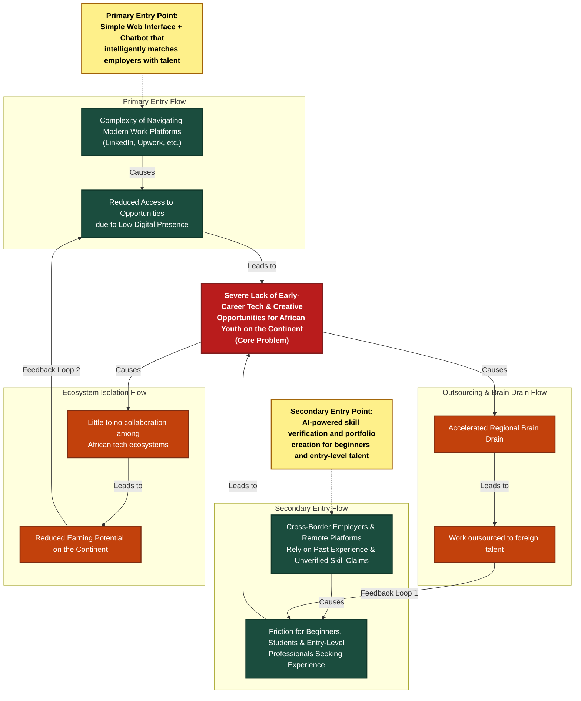

# Systems Map: Pan-African Opportunity Pipeline

This systems map traces the structural forces causing underemployment, reduced access to work, and suppressed earnings among young tech and creative talent in West and East Africa. It defines how **BorderLine** acts as a dual-entry intervention to collapse reinforcing negative loops.

---

## 1. Systemic Architecture (Mermaid Diagram)

---

## 2. Structural Entry Flows

The systems map is powered by two distinct access barriers that funnel into the core ecosystem bottleneck:

### A. The Primary Entry Flow (Digital Representation Barrier)
* **Start Point (Primary Entry Point)**: Navigating traditional platforms (LinkedIn, Upwork) is highly complex for early-career African builders. These platforms require pre-existing networks, historical ratings, and structured resumes.
* **Direct Cause**: Because navigating these platforms is difficult, early-career creators suffer from **Reduced Access to Opportunities due to Low Digital Presence**. Without standard personal portfolios or professional indexing, they remain digitally invisible to the market.
* **Outcome**: Low digital presence feeds directly into the lack of early-career opportunities.

### B. The Secondary Entry Flow (Skill Verification Barrier)
* **Start Point (Secondary Entry Point)**: Cross-border employers and global remote platforms fall back on vetting proxies—primarily looking for past corporate experience and disregarding unverified skill claims.
* **Direct Cause**: This creates massive **Friction for Beginners, Students, and Entry-Level Professionals Seeking Experience**. Without corporate histories, they cannot get their first gig, and without their first gig, they cannot build a corporate history.
* **Outcome**: This systemic exclusion directly prevents them from accessing professional tech opportunities.

---

## 3. The Core Systemic Bottleneck
* **The Core Node**: **Severe Lack of Early-Career Tech & Creative Opportunities for African Youth on the Continent**.
* **Systemic Nature**: This central bottleneck is reinforced by both the digital presence barrier and the skill verification barrier. When talent is blocked at this core node, it triggers macro-level consequences that degrade the entire continental tech ecosystem.

---

## 4. Reinforcing Feedback Loops & Macro Consequences

The absence of entry-level opportunities initiates two distinct negative reinforcing loops:

### 🔄 Loop 1: The Outsourcing and Skill Friction Loop
* **The Chain**: Lack of opportunities $\rightarrow$ Accelerated Regional Brain Drain (talent exiting local ecosystems) $\rightarrow$ Local work is outsourced to foreign talent due to a perceived lack of stable local talent $\rightarrow$ Increases the friction for local beginners and entry-level professionals seeking work $\rightarrow$ Exacerbates the lack of opportunities.
* **Footnote Definition**: *Outsourced work to foreign talent means beginners and entry-level talent on the continent don't access opportunities.*

### 🔄 Loop 2: The Earning Potential and Digital Presence Loop
* **The Chain**: Lack of opportunities $\rightarrow$ Little to no collaboration among African tech ecosystems (isolation of hubs like Accra, Nairobi, Dakar) $\rightarrow$ Reduced earning potential on the continent $\rightarrow$ Less personal resources to invest in building an online presence (hosting, domain fees, stable connectivity) $\rightarrow$ Worsens access to opportunities due to low digital presence.
* **Footnote Definition**: *Reduced earning potential from no collaboration among African tech ecosystems means users access fewer opportunities.*

---

## 5. Targeted Entry Points (BorderLine Interventions)

BorderLine acts as a dual-intervention to disrupt and collapse both reinforcing feedback loops:

1. **Primary Intervention (Disrupts Navigation Complexity)**:
   * *Mechanism*: A simple, low-data Web Interface + WhatsApp Chatbot that intelligently matches employers with local talent. 
   * *Impact*: Lowers the cognitive and internet data barrier for users, bypasses complex platform setups, and routes matching opportunities directly to their mobile devices.
2. **Secondary Intervention (Disrupts Vetting & Credential Reliance)**:
   * *Mechanism*: A cloud-hosted AI engine that performs skill verification and automated portfolio creation.
   * *Impact*: Ingests raw files, code repositories, and unstructured text to auto-generate enterprise-grade case studies, eliminating the requirement for past corporate history.

---

## 6. Stakeholder Matrix: 3-Tier Ecosystem Mapping

| Tier | Stakeholder Group | Direct Systemic Impact | Systemic Role / Influence on Solution |
| :--- | :--- | :--- | :--- |
| **Tier 1: Core Users** | **1. Tech Students / Recent Grads** | Barred from global pipelines due to a complete lack of corporate resume history. | Primary platform adopters; provide the raw code/design assets to feed the AI. |
| | **2. Entry-Level Freelancers** | Experience highly suppressed individual wages and client exploitation due to lack of a validation layer. | Drive early platform volume, transactional data, and system usage validation. |
| **Tier 2: Direct Enablers** | **3. Regional African Startups** | Struggle to source low-cost, verified junior engineering talent across borders safely. | Serve as immediate B2B job providers and early design reviewers. |
| | **4. Global Remote Employers** | Face excessive vetting costs and compliance risks when trying to source unproven talent from SSA. | Act as the primary high-yield capital injects into the ecosystem. |
| | **5. Technical Academic Institutions** | University project databases (like at GCTU) remain unmonetized silos with zero career conversion. | Serve as structured talent pipelines and campus verification partners. |
| **Tier 3: Systemic Influencers** | **6. Local Telecom Carriers** | High data tariffs structurally wall off student access to international developer cloud suites. | Define the baseline bandwidth constraints that our WhatsApp extension must navigate. |
| | **7. Cross-Border FinTech Gates** | Fragmented regional payment corridors restrict smooth cross-border compensation for junior talent. | Provide the underlying escrow, Mobile Money (MoMo), and transaction infrastructure. |
| | **8. Regional Incubation Hubs** | Face high program failure rates because their technical cohorts cannot find international contracts post-graduation. | Provide physical co-working spaces and act as localized credibility validation nodes. |

---

## 7. Refined Problem Statement
> *"Tech-talented students and entry-level freelancers across West and East African tech hubs lack verified digital presence and enterprise-ready professional portfolios. Because global employers and traditional platforms rely heavily on unverified skill claims and past corporate experience, early-career talent faces severe friction accessing opportunities. This isolates them from pipelines, driving accelerated brain drain and outsourced local contracts, resulting in little collaboration among local tech ecosystems and severely reduced earning potential on the continent."*
