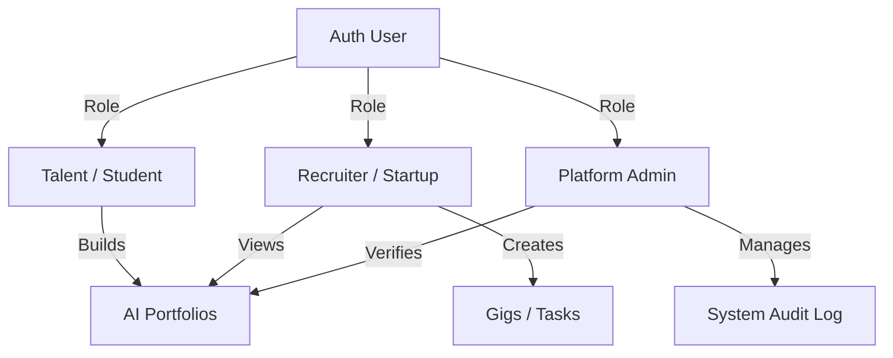

# BorderLine: Technical Architecture & System Design

This document details the production-ready technical architecture for BorderLine. While the initial build is a prototype for the Yango Fellowship, these specifications establish the engineering foundation for scaling to a production-ready global workforce platform.

---

## 1. Architectural Decisions & Tech Stack Selection

After evaluating the core requirements of the platform (relational matching data, secure LLM API orchestration, low-data mobile performance, and rapid deployment), we have selected the following stack:

```text
┌─────────────────────────────────────────────────────────────────────────┐
│                           FRONTEND & BACKEND                            │
│                 Next.js App Router (React, TypeScript)                  │
└────────────────────────────────────┬────────────────────────────────────┘
                                     │
                 ┌───────────────────┴───────────────────┐
                 ▼                                       ▼
┌─────────────────────────────────┐     ┌─────────────────────────────────┐
│        DATABASE & AUTH          │     │        AI ORCHESTRATION         │
│     Supabase (PostgreSQL)       │     │    Gemini API / Vercel AI SDK   │
└─────────────────────────────────┘     └─────────────────────────────────┘
```

### A. Next.js vs. React (SPA/Vite)
* **Decision**: **Next.js (App Router)**.
* **Rationale**: 
  - **Server-Side Security**: BorderLine must securely call LLM APIs (Gemini/OpenAI) to summarize project notes. In a client-only React SPA, API keys would be exposed in the browser. Next.js provides secure Server Actions and API Routes.
  - **Dynamic Route Optimization**: Essential for SEO (so public portfolios can be indexed by search engines) and quick mobile load times via Server-Side Rendering (SSR).
  - **API Endpoints**: Next.js serves as our backend directly, hosting the Webhook endpoints for WhatsApp message routing without needing a separate Express server.

### B. Supabase (PostgreSQL) vs. Firebase (NoSQL)
* **Decision**: **Supabase (PostgreSQL)**.
* **Rationale**:
  - **Relational Integrity**: Talent marketplaces are highly relational (Users $\rightarrow$ Profiles $\rightarrow$ Projects $\leftrightarrow$ Skills $\leftrightarrow$ Gigs $\leftarrow$ Applications). Querying this structure in NoSQL (Firebase Firestore) leads to denormalization overhead and expensive multi-read loops.
  - **pgvector Integration**: Supabase supports `pgvector`, allowing us to store LLM-generated embeddings of user portfolios and job descriptions. This enables **semantic smart-matching** directly in the database using simple cosine similarity queries.
  - **Auth & Row Level Security (RLS)**: Supabase Auth is integrated with Postgres RLS, securing recruiter, talent, and admin data at the database layer.

---

## 2. Multi-Role Ecosystem Design

The database schema will enforce Role-Based Access Control (RBAC) to handle three primary user types:



### 1. Talent (Students & Freelancers)
* **Capabilities**: Create profile, link GitHub/Figma, input raw project notes, trigger AI case-study generation, view matching gigs, and apply for work.
* **UI Scope**: Mobile-friendly Portfolio builder dashboard, job application status feeds.

### 2. Recruiters (African Startups & Global Employers)
* **Capabilities**: Create organization profile, post micro-gigs/entry-level contracts, search verified portfolios, view AI-generated project case studies, and message candidates.
* **UI Scope**: Recruiter search portal, candidate pipeline board (applied, interviewed, hired), job posting creation wizard.

### 3. Platform Admins (Ecosystem Managers)
* **Capabilities**: Audit AI-generated portfolios, manually grant "Verified" trust badges, inspect transaction histories, edit tax/compliance settings, and view macro-analytics dashboards.
* **UI Scope**: Admin dashboard with system metrics, flag queue, and user management.

---

## 3. Database Schema Blueprint (Prisma Model Format)

```prisma
datasource db {
  provider = "postgresql"
  url      = env("DATABASE_URL")
}

enum UserRole {
  TALENT
  RECRUITER
  ADMIN
}

model User {
  id        String   @id @default(uuid())
  email     String   @unique
  role      UserRole @default(TALENT)
  createdAt DateTime @default(now())
  
  profile   Profile?
  recruiter RecruiterProfile?
}

model Profile {
  id           String   @id @default(uuid())
  userId       String   @unique
  user         User     @relation(fields: [userId], references: [id], onDelete: Cascade)
  fullName     String
  country      String
  techFocus    String
  bio          String?
  avatarUrl    String?
  whatsappNum  String?  @unique
  skills       String[] // Array of parsed skills
  isVerified   Boolean  @default(false)
  
  projects     Project[]
  applications Application[]
}

model Project {
  id             String   @id @default(uuid())
  profileId      String
  profile        Profile  @relation(fields: [profileId], references: [id], onDelete: Cascade)
  title          String
  rawInput       String   // Messy notes / code links
  aiSummary      String   // Structured case study markdown
  verifiedSkills String[] // AI extracted skills
  githubUrl      String?
  figmaUrl       String?
  isAudited      Boolean  @default(false)
  createdAt      DateTime @default(now())
}

model RecruiterProfile {
  id          String   @id @default(uuid())
  userId      String   @unique
  user        User     @relation(fields: [userId], references: [id], onDelete: Cascade)
  companyName String
  website     String?
  gigs        Gig[]
}

model Gig {
  id               String        @id @default(uuid())
  recruiterId      String
  recruiter        RecruiterProfile @relation(fields: [recruiterId], references: [id], onDelete: Cascade)
  title            String
  description      String
  requiredSkills   String[]
  budgetGHS        Float
  applications     Application[]
  createdAt        DateTime      @default(now())
}

model Application {
  id        String   @id @default(uuid())
  gigId     String
  gig       Gig      @relation(fields: [gigId], references: [id], onDelete: Cascade)
  profileId String
  profile   Profile  @relation(fields: [profileId], references: [id], onDelete: Cascade)
  status    String   @default("PENDING") // PENDING, SHORTLISTED, REJECTED, HIRED
  createdAt DateTime @default(now())
}
```

---

## 4. Analytics & Observability Pipeline

To guide our growth and ensure system health, we will integrate three tiers of tracking:

1. **Product Analytics (PostHog)**: 
   - *Metrics tracked*: Landing page conversion rate, average time to build a portfolio, search queries used by recruiters, and WhatsApp active users.
   - *Implementation*: PostHog Web SDK (frontend) + PostHog Node SDK (backend/WhatsApp webhook).
2. **Error Monitoring (Sentry)**:
   - *Metrics tracked*: Failed serverless API actions, database query timeouts, and LLM formatting errors.
   - *Implementation*: `@sentry/nextjs` wrap.
3. **Escrow & Transactions (Stripe / Paystack)**:
   - *Metrics tracked*: Micro-gig volume, cross-border payment success rate, and Mobile Money (MoMo) transfer latency.
   - *Implementation*: Webhook hooks to track payout status.
