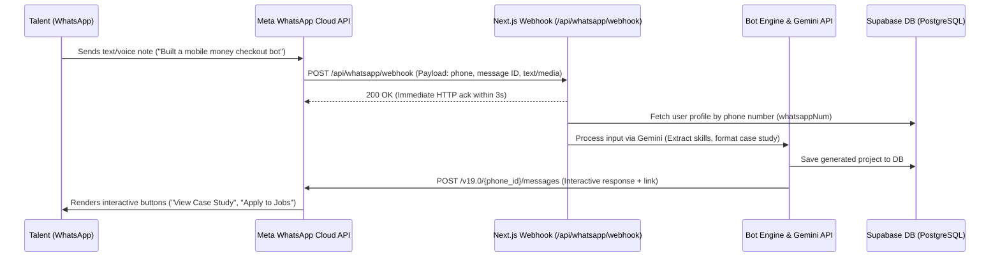

# BorderLine: WhatsApp Bot Technical Architecture

This document details the production-ready technical architecture, sequence flow, and implementation blueprints for BorderLine's WhatsApp-Native Integration.

---

## 1. Overview & System Goals

WhatsApp access enables entry-level African builders on 2G/3G mobile connections to interact with BorderLine without requiring high-bandwidth web apps. 

Via WhatsApp text or voice messages, users can:
- **Build & update portfolios**: Send raw project text or voice notes; the AI parses them into structured case studies.
- **Browse & apply for gigs**: Receive micro-gig matches and apply with quick-reply buttons.
- **Receive notifications**: Get real-time status updates when recruiters view or shortlist their profiles.

---

## 2. End-to-End Architectural Sequence



---

## 3. Core Technical Components

### A. Provider: Meta WhatsApp Cloud API
* **Direct Integration**: Directly connects to Meta's infrastructure without third-party aggregator markups.
* **Credentials**:
  - `WHATSAPP_TOKEN`: Permanent System User Access Token.
  - `WHATSAPP_PHONE_NUMBER_ID`: Meta phone number ID.
  - `WHATSAPP_VERIFY_TOKEN`: Custom secret string for webhook verification.

### B. Webhook Endpoint (`app/api/whatsapp/webhook/route.ts`)
1. **Verification (`GET`)**: Handles Meta's initial handshake to verify domain ownership.
2. **Message Processing (`POST`)**: Receives real-time message events.
   - **Security**: Validates `X-Hub-Signature-256` header against the Meta App Secret.
   - **3-Second Ack Rule**: Returns an immediate HTTP `200 OK` response before starting async background jobs (LLM calls) to prevent Meta retry loops.

---

## 4. State Machine & Session Management

WhatsApp HTTP requests are stateless. State is persisted in Supabase (`Profile.whatsappNum` and session context):

```text
┌────────────────┐     Text / Menu      ┌──────────────────────┐
│  IDLE STATE    ├─────────────────────►│  AWAITING_INPUT      │
│ (Main Menu)    │                      │ (e.g. Project Notes) │
└───────▲────────┘                      └──────────┬───────────┘
        │                                          │
        │           Gemini Parsing                 │
        └──────────────────────────────────────────┘
```

* **User Identification**: Maps sender phone number (e.g. `+233241234567`) to `Profile.whatsappNum`.
* **State Field**: Stores state (`IDLE`, `AWAITING_PROJECT_DETAILS`, `AWAITING_VOICE_NOTE`) in user session state to handle multi-step flows.

---

## 5. Voice Note & AI Processing Pipeline

1. **Media Download**:
   - Webhook extracts `media_id` for voice notes (`.ogg` / `.opus`).
   - Fetches media URL from `GET https://graph.facebook.com/v19.0/{media_id}` and downloads binary stream.
2. **Structured Extraction (Gemini API)**:
   - Gemini converts audio/text into a structured JSON case study:
     ```json
     {
       "title": "E-Commerce Mobile Money Integration",
       "summary": "Implemented Paystack API integration for automated checkout...",
       "verifiedSkills": ["Node.js", "Paystack API", "PostgreSQL"]
     }
     ```
3. **Outbound Interactive Response**:
   - Sends rich response with Quick Reply buttons (e.g., `[View Case Study] [Browse Gigs]`).

---

## 6. Messaging Constraints: 24-Hour Window & Templates

- **Customer Service Window (24h)**: Within 24 hours of user's last message, freeform messages, media, and interactive buttons can be sent.
- **Outbound Notifications (Template Messages)**: Outside the 24-hour window (e.g., job alert notifications), Meta requires pre-approved Message Templates.

---

## 7. Implementation Blueprint (Next.js App Router)

```typescript
import { NextRequest, NextResponse } from "next/server";
import crypto from "crypto";

// 1. Handshake verification (GET)
export async function GET(req: NextRequest) {
  const { searchParams } = new URL(req.url);
  const mode = searchParams.get("hub.mode");
  const token = searchParams.get("hub.verify_token");
  const challenge = searchParams.get("hub.challenge");

  if (mode === "subscribe" && token === process.env.WHATSAPP_VERIFY_TOKEN) {
    return new NextResponse(challenge, { status: 200 });
  }
  return new NextResponse("Forbidden", { status: 403 });
}

// 2. Incoming message handling (POST)
export async function POST(req: NextRequest) {
  const body = await req.json();

  const entry = body.entry?.[0];
  const changes = entry?.changes?.[0];
  const value = changes?.value;
  const message = value?.messages?.[0];

  if (!message) {
    return NextResponse.json({ status: "ignored" });
  }

  const from = message.from; // Sender phone number
  const text = message.text?.body;
  const type = message.type; // 'text', 'audio', 'interactive'

  // Process asynchronously to avoid webhook timeout
  processWhatsAppMessage(from, text, type, message);

  // Return immediate 200 OK to Meta
  return NextResponse.json({ status: "ok" }, { status: 200 });
}

async function sendWhatsAppText(to: string, content: string) {
  await fetch(
    `https://graph.facebook.com/v19.0/${process.env.WHATSAPP_PHONE_NUMBER_ID}/messages`,
    {
      method: "POST",
      headers: {
        Authorization: `Bearer ${process.env.WHATSAPP_TOKEN}`,
        "Content-Type": "application/json",
      },
      body: JSON.stringify({
        messaging_product: "whatsapp",
        to,
        type: "text",
        text: { body: content },
      }),
    }
  );
}
```

---

## 8. Development & Local Testing Setup

1. **Meta Test Number**: Set up in the Meta Developer Portal under WhatsApp -> API Setup.
2. **Webhook Tunneling**: Use **Cloudflare Tunnel** or **ngrok** to expose `localhost:3000/api/whatsapp/webhook` during local development.
3. **Background Execution**: In production (Vercel / Edge Workers), use background execution (`waitUntil`) or an event queue (Upstash / QStash) to handle LLM calls safely after responding `200 OK` to Meta.
