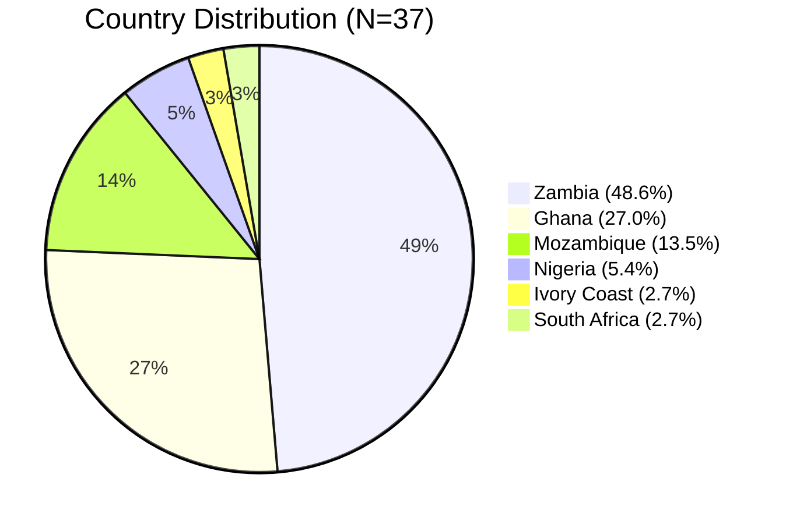
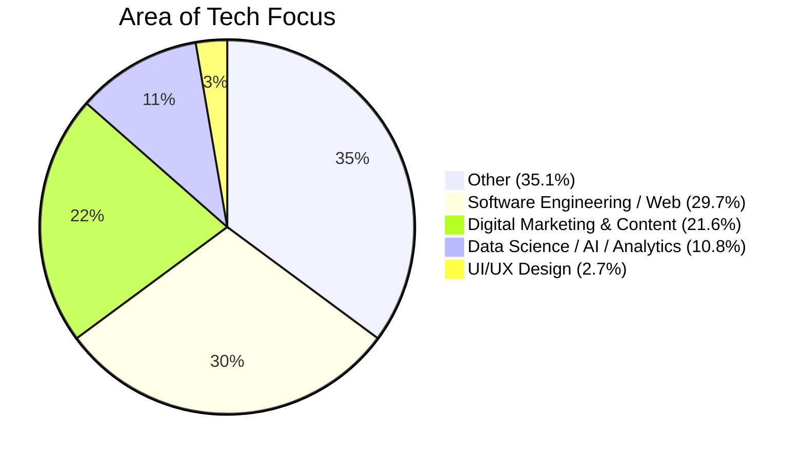
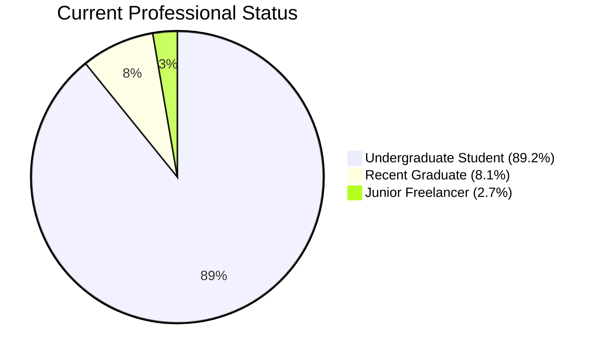
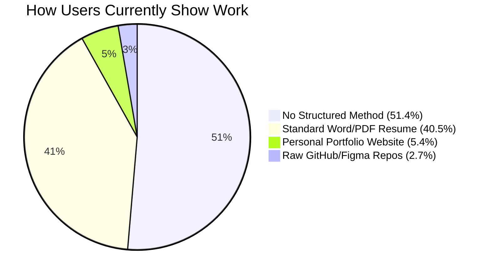
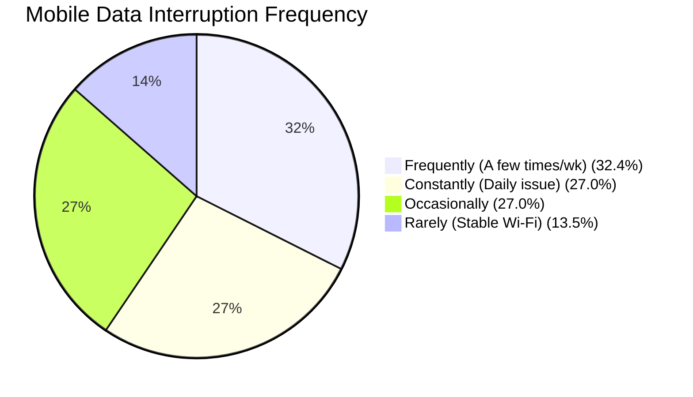
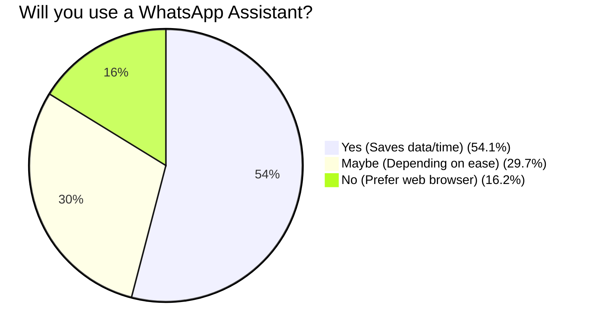

# BorderLine: Survey Analysis & Team Discussion Guide
*User Research Validation Report (N = 37)*

This report compiles the empirical data from our survey, renders visual charts for easy team consumption, and maps out concrete discussion points to guide our fellowship team alignment.

---

## 1. Demographic & Segmentation Charts

### Geographic Distribution of Respondents


### Primary Technical Focus


### Academic & Professional Status


---

## 2. Core Friction Points & Showcase Preferences

### Core Hiring Barriers (Select All That Apply)
```text
Hiring Barrier                                                  % of Respondents
────────────────────────────────────────────────────────────────────────────────
Experience Gatekeeping (3+ yrs required) ░░░░░░░░░░░░░░░ 70.3% (26)
Lack of Industry Connections             ░░░░░░░░░░ 48.6% (18)
Legacy Platforms Exclude New Profiles    ░░░░░░░░ 37.8% (14)
Resumes Limit Practical Skills           ░░░ 13.5% (5)
Cross-Border Language Barriers           ░░░ 13.5% (5)
```

### Current Showcase Methods


---

## 3. Accessibility & Chatbot Validation

### Frequency of Internet/Mobile Data Disruptions


### WhatsApp Assistant Adoption Interest


---

## 4. Key Strategic Insights ("So What?")

1. **The Target Cohort (Undergraduates)**: **89.2%** of respondents are current university students. This indicates our initial go-to-market strategy should focus on campus partnerships (e.g., GCTU, TTU) rather than generic social media ads.
2. **The "Other" Tech Focus (35.1%)**: The largest single group for tech focus chose "Other" (35.1%), followed by software engineering (29.7%). This tells us we shouldn't build BorderLine exclusively for developers. We must support UI/UX, product design, technical writing, graphics, and digital marketing.
3. **The Presentation Paradox**: A massive **91.9%** either have no structured way to show their work or rely on standard PDF/Word resumes. This validates the need for our *AI Portfolio Builder* to structure and package their raw project files.
4. **The Internet Barrier (59.4% Daily/Weekly Interruptions)**: Nearly 60% of our core audience suffers frequent or constant internet disruptions. This is a crucial finding—our web app must be extremely lightweight, and our **WhatsApp integration is mandatory** for accessibility.

---

## 5. Team Discussion Prompts (Moving Forward)

To encourage collaboration, here are key questions each team member should address during our next meeting:

### 🛠️ For Godwin (Engineering & Database)
* **Vector Matching**: Since 70.3% of users are blocked by "3+ years experience" requirements, how can we leverage PostgreSQL (`pgvector`) in Supabase to match users based on *semantic skill similarity* rather than chronological history keywords?
* **Low-Data API**: How can we optimize backend database structures to keep payload sizes minimal for users on slow mobile networks?

### 🎨 For Titos (UI/UX Design & Vetting)
* **Designing the AI Builder Flow**: Given that 51.4% have no structured portfolio, how can we design a "blank state" user experience that doesn't feel intimidating? Can we make the onboarding flow feel like a warm, supportive conversation rather than a job application form?
* **Visualizing the Trust Seal**: How do we visually present the "AI-Verified" trust badge on recruiter feeds to make it stand out?

### 📈 For Brahima (Product & Marketing)
* **Campus Outreach**: Since 89.2% of users are university students, can we design a "Portfolio Build-a-thon" campaign on target campuses (Zambia and Ghana) to gather our first 100 users?
* **User Onboarding via WhatsApp**: How should we market the WhatsApp integration? Should we position it as a "resume-updating assistant" or a "data-free job alert service"?
